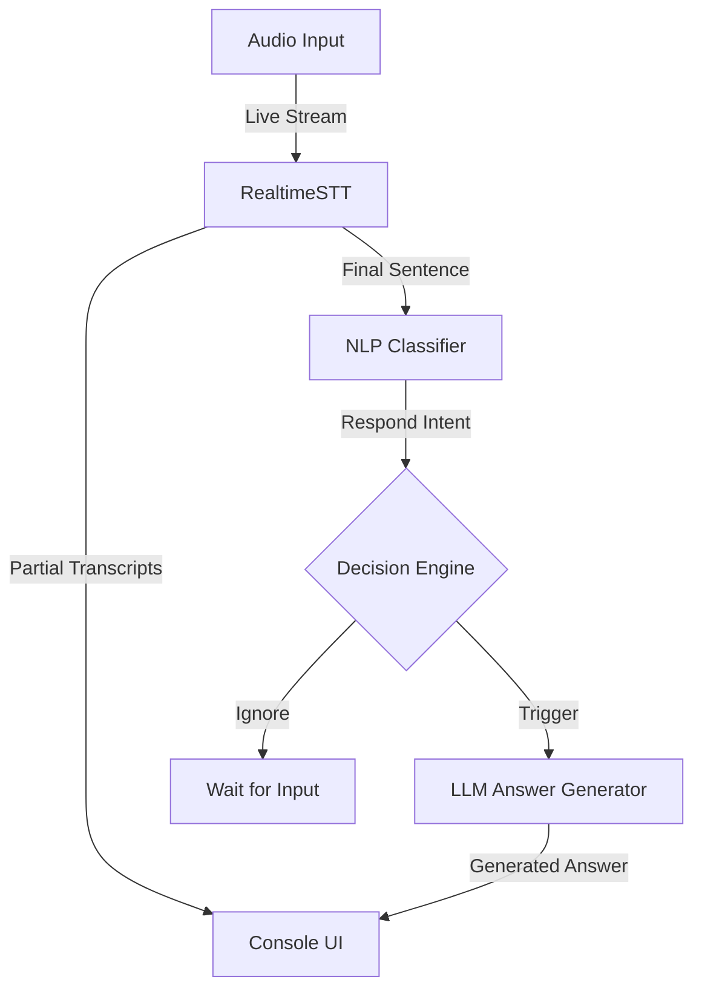

# Interview Copilot

**Interview Copilot** is a high-performance, real-time AI assistant built to support candidates during interviews. By transcribing audio on the fly and generating concise, professional answers using state-of-the-art LLMs via the Groq API, it provides a seamless second-brain experience for technical and behavioral assessments.

---

## System Architecture



---

## Key Features

-   **Low-Latency Transcription**: Powered by `RealtimeSTT` (utilizing `faster-whisper`) for near-instant speech recognition.
-   **Intelligent Intent Classification**: Automatically distinguishes between interviewer questions, conversational filler, and background noise.
-   **Context-Aware Responses**: Generates 2-3 sentence answers tailored for verbal interviews, maintaining a rolling conversation history for follow-ups.
-   **Streaming Output**: Displays partial transcripts and generated answers in real-time for immediate feedback.
-   **Optimized Inference**: Leverages Groq's high-speed cloud infrastructure for sub-second LLM responses.

---

## Technical Stack

-   **STT Engine**: [RealtimeSTT](https://github.com/KoljaB/RealtimeSTT) (`faster-whisper`)
-   **LLM Provider**: [Groq Cloud SDK](https://console.groq.com/)
-   **Audio Backend**: PyAudio
-   **Models**: 
    -   *Transcription*: `tiny.en` (real-time) & `base.en` (final)
    -   *Intelligence*: Groq-optimized Large Language Models

---

## Installation & Setup

### 1. Prerequisites
-   **Python 3.9+**
-   **FFmpeg**: Required for audio processing.
    -   *Windows*: `choco install ffmpeg`
    -   *macOS*: `brew install ffmpeg`
-   **PortAudio**: Required for PyAudio (if not pre-installed).

### 2. Clone and Install
```bash
git clone <repository-url>
cd "interview copilot"
pip install -r requirements.txt
```

### 3. Environment Configuration
Create a `.env` file in the root directory:
```env
GROQ_API_KEY=your_groq_api_key_here
```

---

## Usage

### Step 1: Identify Your Microphone
Run the utility to find the index of your preferred audio input device:
```bash
python audio_devices.py
```

### Step 2: Configure and Launch
1. Open `main.py` and set `DEVICE_INDEX` to your microphone's index (default is `1`).
2. Start the assistant:
```bash
python main.py
```

---

## Project Structure

-   `main.py`: The central orchestrator for the STT-NLP-LLM pipeline.
-   `audio_devices.py`: Utility script to list available audio input indices.
-   `stt/`: Contains the `RealtimeSTT` integration and configuration.
-   `nlp/`:
    -   `classifier.py`: LLM-based logic for identifying speech intent and actions.
    -   `answer_generation.py`: Prompt engineering and response generation logic.

---

## Troubleshooting

-   **Audio Input Issues**: Ensure the `DEVICE_INDEX` in `main.py` matches the output from `audio_devices.py`.
-   **API Rate Limits**: Check your Groq dashboard if you encounter connection or rate-limit errors.
-   **Transcription Accuracy**: If performance allows, the models can be upgraded to `small.en` or `medium.en` in `stt/realtimeSTT.py` for higher precision.

---

## Disclaimer

This tool is designed for educational and preparation purposes. Please ensure your use of this assistant complies with the ethical guidelines and rules of your specific interview process.
