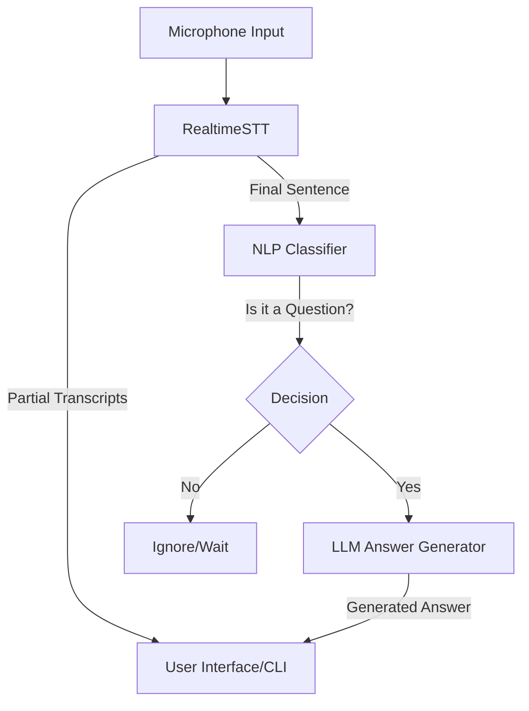

# 🎙️ Interview Copilot

**Interview Copilot** is a real-time AI assistant designed to help candidates during interviews by transcribing questions and generating concise, professional answers on the fly. It leverages high-performance Speech-to-Text (STT) and state-of-the-art Large Language Models (LLMs) via the Groq API.

---

## 🏗️ Architecture



---

## 🚀 Features

-   **Real-time Transcription**: Uses `RealtimeSTT` (powered by `faster-whisper`) for low-latency, accurate speech recognition.
-   **Intelligent Intent Classification**: Automatically distinguishes between interview questions, filler speech, and background noise.
-   **AI Answer Generation**: Generates clear, 2-3 sentence answers tailored for verbal interviews using Groq's high-speed inference.
-   **Context-Aware**: Maintains a rolling history of the conversation to provide relevant follow-up answers.
-   **Interactive Setup**: Easily identify and select your microphone device index.

---

## 🛠️ Tech Stack

-   **STT Engine**: [RealtimeSTT](https://github.com/KoljaB/RealtimeSTT) (Faster-Whisper)
-   **LLM Inference**: [Groq Cloud SDK](https://console.groq.com/)
-   **Audio Handling**: PyAudio
-   **Language**: Python 3.9+
-   **Models**: 
    -   Transcription: `tiny.en` (real-time) & `base.en` (final)
    -   Intelligence: `llama-3.3-70b` (or configured via Groq)

---

## 📦 Installation

1.  **Clone the repository**:
    ```bash
    git clone https://github.com/yourusername/interview-copilot.git
    cd "interview copilot"
    ```

2.  **Install dependencies**:
    ```bash
    pip install -r requirements.txt
    ```

3.  **System Dependencies**:
    -   **FFmpeg**: Required for audio processing.
        -   Windows: `choco install ffmpeg`
        -   macOS: `brew install ffmpeg`
    -   **PortAudio**: Required for PyAudio (if not bundled).

4.  **Configure Environment**:
    Create a `.env` file in the root directory:
    ```env
    GROQ_API_KEY=your_groq_api_key_here
    ```

---

## 🚦 Usage

1.  **Identify Microphone**:
    Run the utility to find your device index:
    ```bash
    python audio_devices.py
    ```

2.  **Start the Assistant**:
    ```bash
    python main.py
    ```
    -   Input your microphone index when prompted (defaults to 1).
    -   The system will start listening and output results to the console.

---

## 📂 Project Structure

-   `main.py`: The orchestrator for the STT-NLP-LLM pipeline.
-   `audio_devices.py`: Utility to list audio input devices.
-   `stt/`: Contains the `RealtimeSTT` wrapper and configuration.
-   `nlp/`: Logic for classifying transcripts and identifying intents.
-   `answers/`: LLM prompt engineering and answer generation logic.

---

## 🔧 Troubleshooting

-   **No Audio Detected**: Ensure the `DEVICE_INDEX` in `main.py` or the input prompt matches your microphone from `audio_devices.py`.
-   **Groq Errors**: Verify your API key in `.env` and check your rate limits on the Groq dashboard.
-   **Low Accuracy**: The system uses `tiny.en` for speed; you can upgrade to `small.en` or `medium.en` in `stt/realtimeSTT.py` if your hardware allows.

---

## ⚠️ Disclaimer

This tool is for educational and preparation purposes only. Please adhere to the rules and ethical guidelines of any interview process you participate in.
